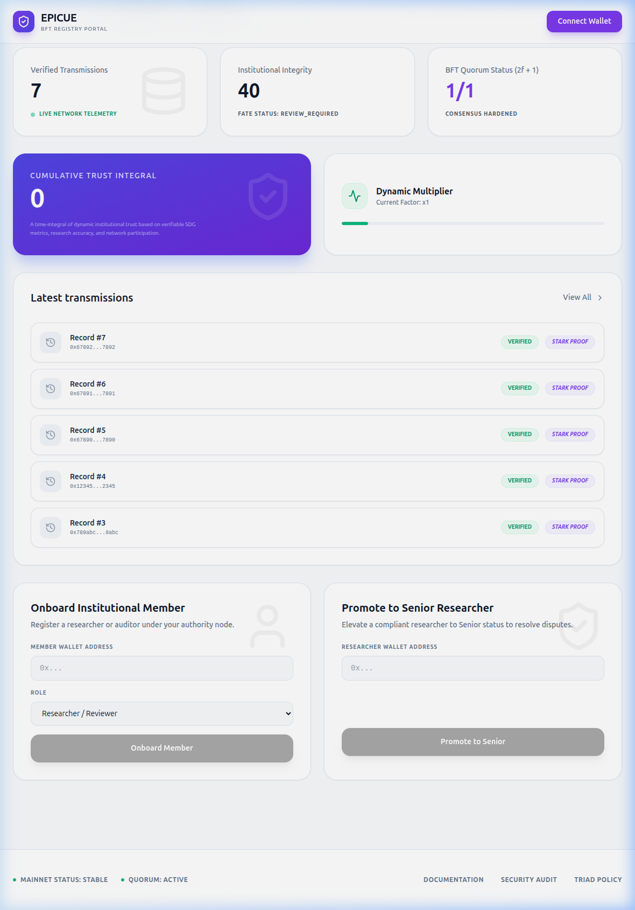
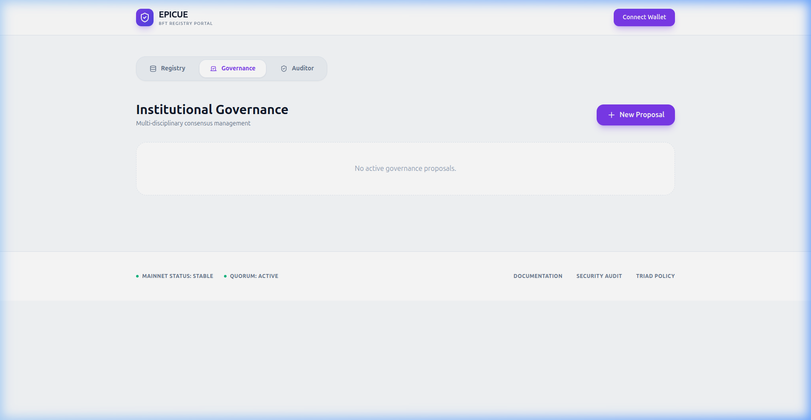
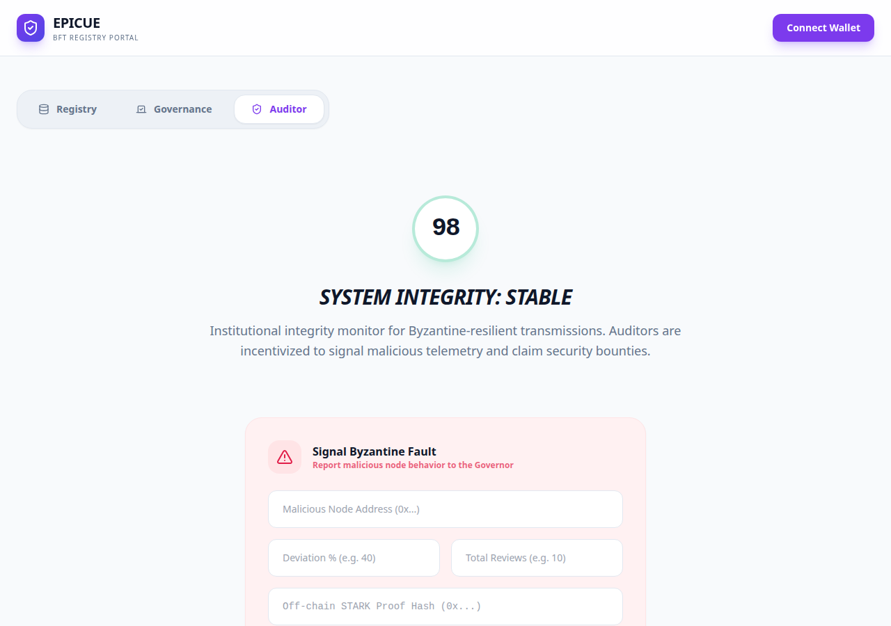

# Epicue

**Equity, Privacy, and Integrity with Cairo in Untrusted Environments**

Epicue is a Starknet-native framework designed to provide a mathematically verifiable, Byzantine-fault-tolerant registry for societal services. It ensures that public service data is handled with absolute transparency and integrity, even in the presence of malicious nodes in untrusted internet environments.

---

## Byzantine Fault Tolerance (BFT) & Governance
Epicue is engineered for the untrusted Internet. Unlike typical centralized registries, Epicue incorporates **Scientific BFT Resilience** ($n=3f+1$):
- **2f+1 Scientific Quorum**: New methodologies and research protocols require cryptographically-verified endorsements from a $2f+1$ institutional majority.
- **Decentralized Governance Locks**: All administrative actions (authority management, reputation floors) are strictly locked behind the EQUISYS Governor. Modifications are only executable via successful voting proposals.
- **Graded Byzantine Slashing**: Institutional penalties are categorized by severity (Minor, Major, Critical). Critical faults result in architectural revocation of authority.
- **Security Bounties**: A built-in **Bounty Credit** system incentivizes specialized auditors to detect and flag Byzantine faults.

## Package Hierarchy
The codebase is structured into logical layers to facilitate inter-institutional scale-up:

```text
├── src/# Cairo Core Implementation
│   ├── core/           # Fundamental Logic (Access, Metadata, Types)
│   ├── triad/          # The EQUISYS Triad (Validator, Auditor, Governor)
│   ├── research/       # Scientific Productivity (BFT Peer Review, Methodology)
│   ├── social/         # Equity & Inclusion (DRI, Reputation, Bounty)
│   └── metrics/        # High-Level Analytics (Sustainability Ledger)
├── tests/              # Byzantine Resilience & Performance Tests
└── portal/        # Production-Grade Vite Client
```

## Institutional Portal

The Epicue Registry Portal provides a high-fidelity interface for institutional stakeholders to interact with the Starknet-native BFT registry.







## Scientific Metrics & SDGs
Epicue translates UN Sustainable Development Goals (SDGs) into STARK-proven metrics:
- **Digital Reach Index (DRI)**: Measures the social equity of public services (SDG 10).
- **Green Stature Index**: Tracks longitudinal sustainability in manufacturing sectors like Steel Mills (SDG 12).
- **FATE Compliance Score**: A real-time measure of institutional accountability (SDG 16).

## Getting Started

### Prerequisites
- [Scarb](https://docs.swmansion.com/scarb/) (Cairo package manager)
- [Starknet Foundry (snforge)](https://foundry-rs.github.io/starknet-foundry/)

### Build & Audit
Compile the BFT-hardened contracts:
```bash
scarb build
```

Run the resilience suite:
```bash
snforge test
```

### Deployment

Epicue supports a unified deployment architecture for both local and public targets. See the [Deployment Guide](file:///home/pradeeban/Epicue/Deployment.md) for detailed instructions.

1. **Configure Environment**: Choose your target.
   ```bash
   cp deployment/sepolia.env.template deployment/.env
   # Edit deployment/.env with your secrets
   ```

2. **Run Deployment Script**: Ensure your account is funded and your keystore is accessible.
   ```bash
   chmod +x deployment/deploy_sepolia.sh
   ./deployment/deploy_sepolia.sh
   ```

## Security & Byzantine Resilience
The framework enforces a rigorous $n=3f+1$ Byzantine Fault Tolerance model. Security audits are performed on-chain by the EQUISYS Triad, and proven malicious behavior results in institutional slashing.

---
*Strengthening citizens' trust through objective cryptographic guarantees.*
