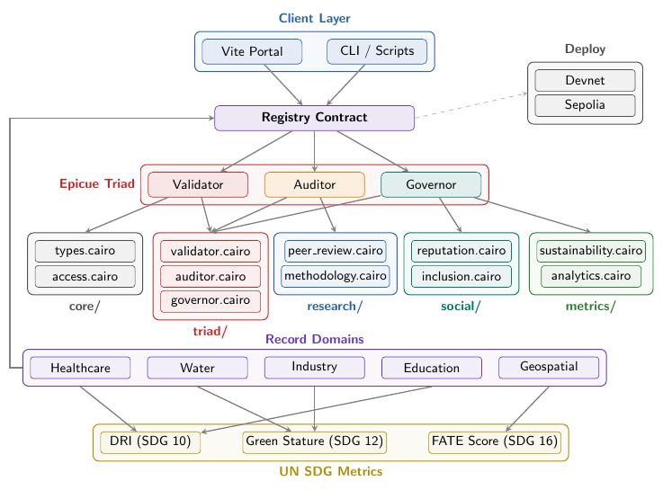

# Epicue Deployment Architecture

This document outlines the deployment and architectural layers of the Epicue framework, providing a high-fidelity overview of how institutional data transitions from local subject records to globally verifiable STARK-proven metrics.

## Graphical Abstract

### Figure Explanation

The graphical abstract above illustrates the end-to-end flow of the Epicue system, structured into logical layers that operationalize the FATE principles (Fairness, Accountability, Transparency, and Ethics).

1.  **Client Layer**: The primary interface for institutional stakeholders, consisting of a production-grade **Vite Portal** for human interaction and specialized **CLI / Scripts** for automated transmissions.
2.  **The Registry Contract**: A central Starknet-native smart contract that manages the institutional state. It acts as the gateway between untrusted internet environments and the secure, ZK-proven execution layer.
3.  **The Epicue Triad**: A specialized set of functional roles that provide checks and balances within the system:
    *   **Validator**: Enforces technical constraints and geospatial boundaries for incoming data.
    *   **Auditor**: Performs post-computation analysis to signal Byzantine faults and maintain structural health.
    *   **Governor**: Manages the decentralized voting process and calculates real-time institutional reputation.
4.  **Modular Package Ecosystem**: The framework is decomposed into five core Cairo 2 packages:
    *   `core/`: Fundamental types and access control.
    *   `triad/`: Logic for the three primary node types.
    *   `research/`: Byzantine-resilient peer review and methodology guidelines.
    *   `social/`: Metrics for equity and inclusion (DRI, Reputation).
    *   `metrics/`: Longitudinal analytics and sustainability ledgers.
5.  **Record Domains & UN SDG Metrics**: Public service data (Healthcare, Water, Industry, Education, Geospatial) is processed through the Triad to generate **STARK-proven metrics** mapped to United Nations Sustainable Development Goals:
    *   **DRI (SDG 10)**: Digital Reach Index for social equity.
    *   **Green Stature (SDG 12)**: Verified sustainability tracking.
    *   **FATE Score (SDG 16)**: Real-time institutional accountability monitor.

---

## Deployment Workflow

Epicue supports a unified deployment model targeting both local development and public testnets.

### 1. Local Development (Devnet)
For rapid prototyping and BFT simulation, deploy to a local Starknet Devnet. This environment supports high-frequency transmissions and instant block finality.

### 2. Public Testnet (Sepolia)
For production-ready inter-institutional validation, the framework is deployed to the Starknet Sepolia network. This ensures that all STARK proofs are finalized on Ethereum Layer 1, providing absolute cryptographic security.
